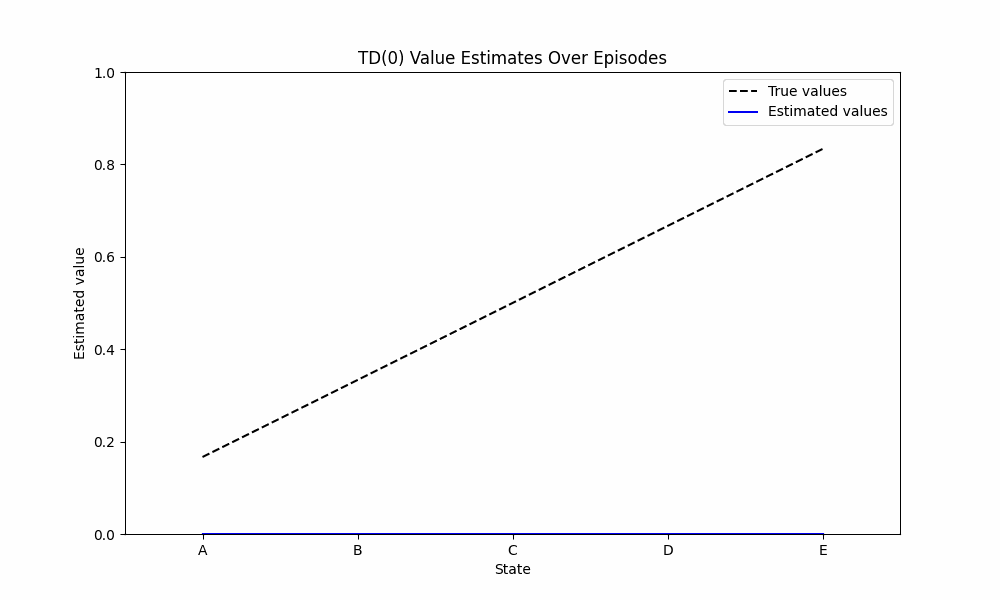

# Temporal-Difference-Learning-Simulation
This is a convergence simulation for Reinforcement learning, Temporal difference learning, The example is taken from the slides of David Silver, and then I have simualted its GIF using python, You can try tweaking the hyperparameters or the state space and then observe the convergence simulations across epochs.

